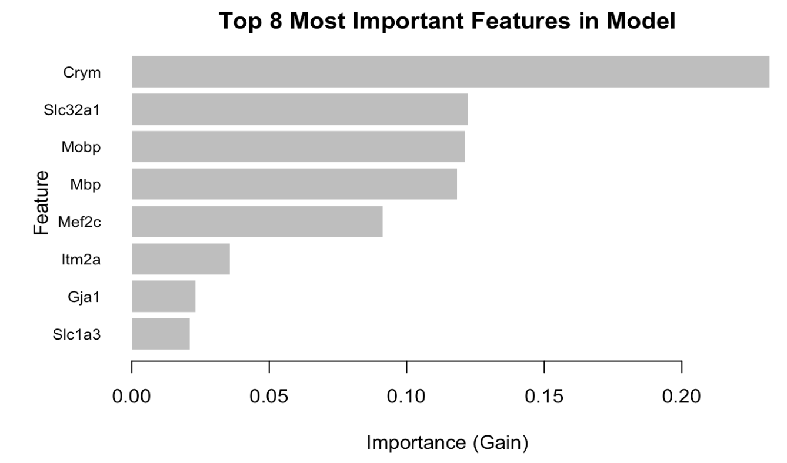
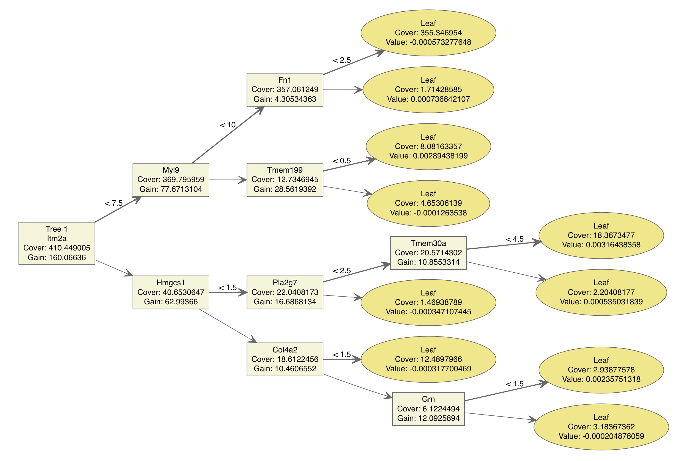
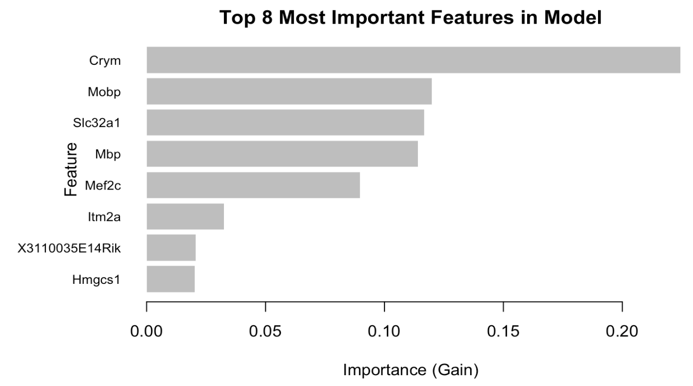
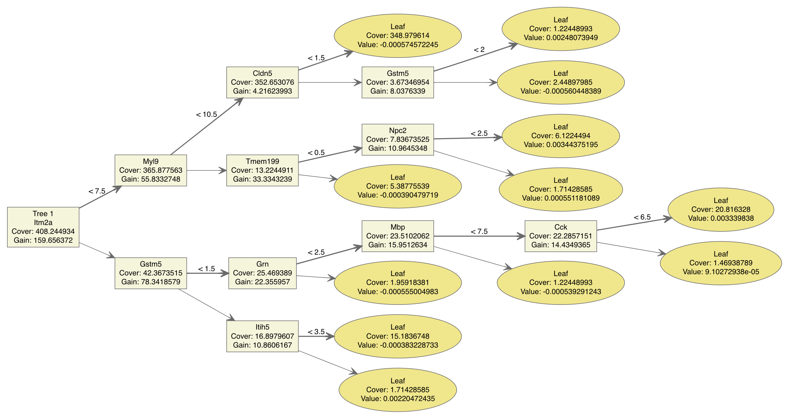

```{r setup, include=FALSE}
knitr::opts_chunk$set(echo = TRUE)
library(glmnet)
library(xgboost)
library(MASS)
library(PMA)
library(kableExtra)
source("https://raw.githubusercontent.com/xuranw/469_public/master/hw6/hw6_functions.R")
```

# Introduction

The data set being used for this analysis is the Zeisel data set. The data set contains single cell RNA sequencing data, including gene expression data for thousands of genes and cell type labels. Altogether, the data set has 3005 observations (rows) of 1002 attributes (columns). A preliminary importing task involved setting the row name to the cell name rather than the row indices, making the total number of columns 1001. When performing group-bys, the data set contains seven cell types: astrocytes_ependymal, endothelial-mural, interneurons, microglia, oligodendrocytes, pyramidal CA1, and pyramidal SS. The smallest group is microglia, which contains 98 cells, and the largest, pyramidal CA1, which contains 939 cells. This reference information is useful because when we do our classification, we will have a rough idea of how many separate clusters to expect, as well as the relative size of each cluster.

As mentioned, the Zeisel data set is most compatible with clustering analysis. In this report, two types of clustering will be done. The first is k-means clustering of the seven cell types. With this strategy, both naive and sparse k-means will be done and the results will be compared. Since there are so many genes to cluster within seven cell groups, it is interesting to see if the sparse k-means clustering does a better job dividing the output into seven distinct groups, like we expect it to. An additional wrinkle with k-means is that by default, the euclidean distance is used to find the distances between points. A spherical k-means clustering will also be used and compared in the naive run. However, due to the time it takes to calculate the sparse PCA, it will not be feasible to apply the formula to both the euclidean and the spherical formulas.

The second type of analysis is using the XGBoost package in R (extreme gradient boosting). The package supports many different types of functions, but the method to be used here will be tree learning for classification purposes. The goal of the second analysis is to view which gene is the most important for various cell groups- by volume of occurrence. In addition, cell types will also be predicted based on the known rate of occurrences of certain genes. The two iterations run here are the basic run (with parameters filled in with commonly accepted values) and a run with an added parameter L2 regularization with a value of 0.1. The theoretical objective of adding this new parameter is to lower variance, while increasing bias. This is a common way to counter overfitting of the model. The results of the two runs are compared.

# Data
The Zeisel dataset collects data on RNA sequencing for 3005 mouse cells across 1000 genes. 

```{r echo=FALSE}
tmp <- read.csv("zeigel.csv", row.names=1)
expr_mat <- as.matrix(tmp[,-1])
cell_types <- as.factor(tmp[,1])
table(cell_types) #format into nicer table
```

We see that the dataset contains 7 types of labelled cells, with pyramidal CA1 being the most common and microglia being the least common.

```{r include = FALSE}
ctype_list = c("astrocytes_ependymal", "endothelial-mural", "interneurons", 
               "microglia", "oligodendrocytes", "pyramidal CA1", "pyramidal SS")

colors = c("blue", "green", "red", "black", "yellow", "orange", "purple")

colorize = function(ctype){
  color = rep(NA, length=K)
  color[which(ctype=="astrocytes_ependymal")] = "blue"
  color[which(ctype=="endothelial-mural")] = "green"
  color[which(ctype=="interneurons")] = "red"
  color[which(ctype=="microglia")] = "black"
  color[which(ctype=="oligodendrocytes")] = "yellow"
  color[which(ctype=="pyramidal CA1")] = "orange"
  color[which(ctype=="pyramidal SS")] = "purple"
  return(color)
}
```

# PCA Clustering Analysis
```{r, echo=FALSE, warning=FALSE}
normalize <- function(x){
  S = sum(x)
  x = x / S
  return(x * (10^4))
}
expr_mat <- t(apply(expr_mat, 1, normalize))
expr_mat <- log2(expr_mat + 1)
expr_mat <- scale(expr_mat)
```


```{r, include=FALSE, cache=TRUE}
pc <- prcomp(expr_mat, center=T, scale.=T)
expr_pca <- pc$x[, 1:4]
expr_pca <- scale(expr_pca)
```

```{r, echo=FALSE, fig.width=6}
plot(1:1000, pc$sdev, pch=20, main = "Scree plot of full data",
                             xlab = "Index of principal component",
                             ylab = "Square root of eigenvalues")
```

```{r, fig.width=6}
colors <- rep(NA, length=1000)
colors[which(cell_types == "astrocytes_ependymal")] = "black"
colors[which(cell_types == "endothelial-mural")] = "green"
colors[which(cell_types == "interneurons")] = "red"
colors[which(cell_types == "microglia")] = "blue"
colors[which(cell_types == "oligodendrocytes")] = "purple"
colors[which(cell_types == "pyramidal CA1")] = "orange"
colors[which(cell_types == "pyramidal SS")] = "yellow"
plot(expr_pca[, 1], expr_pca[, 2], col=colors, pch=20, ylim = c(-5, 15), main = "Visualizing data (True clusters, full data)",
                                                                         xlab = "First principal component",
                                                                         ylab = "Second principal component")

legend("bottomleft", inset=.02, c("astrocytes_ependymal", "endothelial-mural", "interneurons", "microglia", 
                                  "oligodendrocytes", "pyramidal CA1", "pyramidal SS"),
                                fill=c("black", "red", "green", "blue", "purple", "orange", "yellow"), cex=0.8, bty="n")

```

The scree plot shows about 10 points that may be considered "outliers", as they are disconnected from the rest of the lines. This indicates we most likely do not need to use beyond the first ten principle components, but we may choose to use fewer than ten.

The cluster graph shows three out of the seven cell types (pyramidal CA1, interneurons, oligodendrocytes) placed in a visible cluster. The astrocytes_ependymol (in black) also appears to be clustered in a group, but is overshadowed by the green-colored group- and it's hard to distinguish the two. The three remaining groups looks to be quite scattered. However, that may just be due to the limitation of the data set. For example, certain cell types of 10x more data points than other cell types.


```{r, echo=FALSE}
# euclidian k means w/ matrix
set.seed(46)
conf_matrix <- kmeans(expr_mat, centers=7)
table(conf_matrix$cluster, cell_types)
compute_misclustering_rate(cell_types, conf_matrix$cluster)
```

Using the normal euclidean distance k-means on the expression matrix, it seems like cell groups 4-7 are classified really well. However, groups 1-3 have two or three decently large groups of cell types. Groups 1 (pyramidal CA1, pyramdial SS) and 3 (endothelilal-mural, microglia) seems to especially have a hard time clustering one cell type in its grouping. Pyramidal CA1 cells also have very large groupings in both groups 1 and 5. The mis-calculation rate for this analysis is 26.6%.

```{r, echo=FALSE}
# sphereical k means w/ matrix
set.seed(46)
conf_matrix_sphere <- skmeans(expr_mat, 7)
table(conf_matrix_sphere$cluster, cell_types)
compute_misclustering_rate(cell_types, conf_matrix_sphere$cluster)
```

Using the spherical distance k-means on the expression matrix, it seems like all cell groups with the exception of group 4 was clustered relatively well, balancing between endothelial-mural and microglia type cells. Going down the columns, it seems like all cell types were grouped pretty well too, with the exception of pyramidal CA1- splitting its instances between groups 2 and 5. Even though the misclustering rate is 25% (marginal statistical improvement), the eye test shows much improvement when switching over to the spherical distance formula.

```{r, echo=FALSE}
# euclidian k means w/ pca
set.seed(46)
conf_matrix_d <- kmeans(expr_pca, centers=7)
table(conf_matrix_d$cluster, cell_types)
compute_misclustering_rate(cell_types, conf_matrix_d$cluster)
```

Using the default euclidean distance k-means on the expression PCA calculations, it looks like groups 3 and 6 are clustered solidly. All other groups have a decently large proportion of at least two cell-types. And going down the cell types, the first four are grouped well. However, oligodendrocytes, pyramidal CA1, and pyramidal SS cell types are split among multiple cell groups. The misclustering rate for this analysis is 36.8%.

```{r}
# sphereical k means w/ pca
set.seed(46)
conf_matrix_d_sphere <- skmeans(expr_pca, 7)
table(conf_matrix_d_sphere$cluster, cell_types)
compute_misclustering_rate(cell_types, conf_matrix_d_sphere$cluster)
```

Using the spherical distance k-means on the expression PCA calculations, it looks like only group 6 is clostly associate with a cell type- meaning there is a good chance it is being overfit. Other groups have a solid proportion of three to four different cell types. And looking at the cell types, astrocytes_ependymal, endothelial-mural, and microglia cell types looks like they are closely associated with a grouping. The other cell types are not. The miscalculation rate here is 35.3% Compared to the default distance formula, the misclustering rate shows a marginal improvement However the table does not indicate a major benefit in terms of better clustering, and in some aspects, even looks worse than before.

Overall, the PCA calculations hold a higher miscalculation rate from just the matrix, regardless of which distance formula is used. When switching over to the spherical distance formula, there is an improvement in the miscalculation rate. However, the results of the tables are mixed, showing improvements at times and no improvements at other times.


```{r, cache=TRUE, echo=FALSE}
# dont run this again lol 
set.seed(46)
spca_cv_res <- SPC.cv(expr_mat, sumabsvs = seq(1.2, sqrt(ncol(expr_mat))/2, length.out = 10))
```

```{r, include=FALSE, cache=TRUE}
spca_res <- SPC(expr_mat, sumabsv = spca_cv_res$bestsumabsv1se, K=7) # k changed from 4
gene_idx <- which(t(spca_res$v)!=0)%/%7 # changed from 4
expr_mat_screened <- scale(expr_mat[, gene_idx])
```


```{r, echo=FALSE, cache=TRUE}
set.seed(46)
expr_spca <- prcomp(expr_mat_screened, center=T, scale.=T)$x[, 1:4]
expr_spca <- scale(expr_spca)
conf_matrix_f = kmeans(expr_spca, centers=7)
table(conf_matrix_f$cluster, cell_types)
compute_misclustering_rate(cell_types, conf_matrix_f$cluster)
```

```{r}
set.seed(46)
conf_matrix_f_sphere = skmeans(expr_spca, 7)
table(conf_matrix_f_sphere$cluster, cell_types)
compute_misclustering_rate(cell_types, conf_matrix_f_sphere$cluster)
```

When using the sparse PCA calculations applied to both the euclidean distance and the spherical distance, the miscalculation rate improves marginally (32.9%, 32.8%). However, this time, there is no noticeable improvement between the two distance formulas. When viewing the tables, in both cases it seems like half of the cell groups are classified well, and the other half is not. Overall the table does not indicate improvement between distance types or sparse PCA vs vanilla PCA. That being said, based on the formula applied in HW6, there seems to be a mathematical improvement when moving to sparse PCA.

```{r, echo=FALSE}
colors <- rep(NA, length=1000)
colors[which(cell_types == "astrocytes_ependymal")] = "black"
colors[which(cell_types == "endothelial-mural")] = "green"
colors[which(cell_types == "interneurons")] = "red"
colors[which(cell_types == "microglia")] = "blue"
colors[which(cell_types == "oligodendrocytes")] = "purple"
colors[which(cell_types == "pyramidal CA1")] = "orange"
colors[which(cell_types == "pyramidal SS")] = "yellow"
plot(expr_spca[, 1], expr_spca[, 2], col=colors, pch=20, main = "Visualizing data (True clusters, screened data)",
                                                         xlab = "First principal component",
                                                         ylab = "Second principal component")
legend("bottomleft", inset=.02, c("astrocytes_ependymal", "endothelial-mural", "interneurons", "microglia", 
                                  "oligodendrocytes", "pyramidal CA1", "pyramidal SS"),
                                fill=c("black", "red", "green", "blue", "purple", "orange", "yellow"), cex=0.8, bty="n")
```
Now viewing the classification plot when using sparse PCA, there does seem to be an improvement from before. The most noticable aspect is the black group (astrocytes_ependymal) clearly being separated from the green (interneurons). Other than that, the orange, purple, and green are still distinct. The blue (microglia) group is still very scattered and not clustered at all. However, that may again be due to its small sample size. Interestingly, the red (endothelial-mural) and yellow (pyramidal SS) groups look like they are clustered, but are hidden behind the orange clusters. In any case, it does not appear that the three groups have a great separation from each other.


# XGBoost Classification
```{r include=FALSE}
library(xgboost)
```

XGBoost is a powerful classification model that uses gradient boosting to outperform many other algorithms for classification. 

```{r include=FALSE}
set.seed(10)
n = nrow(tmp)
#labels must be [0:n)
labels = as.integer(factor(cell_types, levels=c("astrocytes_ependymal", "endothelial-mural", "interneurons", "microglia","oligodendrocytes", "pyramidal CA1", "pyramidal SS"), labels=1:7))-1
train.index = sample(n,floor(0.75*n))
train.data = as.matrix(expr_mat[train.index,])
train.label = labels[train.index]
test.data = as.matrix(expr_mat[-train.index,])
test.label = labels[-train.index]
```

As aforementioned, the full Zeisel dataset collects data on 3005 mouse cells. To conduct XGBoost classification, we first randomly split the data into training (75%) and testing (25%), i.e. Leave-One-Out Cross Validation (LOOCV), which will allow us to verify the model's findings. 

```{r include = FALSE}
# Transform the two data sets into xgb.Matrix
xgb.train = xgb.DMatrix(data=train.data,label=train.label)
xgb.test = xgb.DMatrix(data=test.data,label=test.label)

# Define the parameters for multinomial classification
num_class = length(levels(cell_types))
params = list(
  booster="gbtree",
  eta=0.001,
  max_depth=5,
  gamma=3,
  subsample=0.75,
  colsample_bytree=1,
  objective="multi:softprob",
  eval_metric="mlogloss",
  num_class=num_class
)
```

```{r echo=FALSE, message=FALSE}
# Train the XGBoost classifer
xgb.fit=xgb.train(
  params=params,
  data=xgb.train,
  nrounds=20,
  nthreads=1)

# Review the final model and results
xgb.fit
```

```{r include=FALSE}
xgb.pred = as.data.frame(predict(xgb.fit, train.data, reshape=T))
colnames(xgb.pred) = c("astrocytes_ependymal", "endothelial-mural", "interneurons", "microglia","oligodendrocytes", "pyramidal CA1", "pyramidal SS")

# Use the predicted label with the highest probability
xgb.pred$prediction = apply(xgb.pred,1,function(x) colnames(xgb.pred)[which.max(x)])
xgb.pred$label = c("astrocytes_ependymal", "endothelial-mural", "interneurons", "microglia","oligodendrocytes", "pyramidal CA1", "pyramidal SS")[train.label+1]

# Calculate error
result = sum(xgb.pred$prediction!=xgb.pred$label)/nrow(xgb.pred)
print(paste("Training Error =",sprintf("%1.2f%%", 100*result)))

xgb.pred = as.data.frame(predict(xgb.fit, test.data, reshape=T))
colnames(xgb.pred) = c("astrocytes_ependymal", "endothelial-mural", "interneurons", "microglia","oligodendrocytes", "pyramidal CA1", "pyramidal SS")

# Use the predicted label with the highest probability
xgb.pred$prediction = apply(xgb.pred,1,function(x) colnames(xgb.pred)[which.max(x)])
xgb.pred$label = c("astrocytes_ependymal", "endothelial-mural", "interneurons", "microglia","oligodendrocytes", "pyramidal CA1", "pyramidal SS")[test.label+1]

# Calculate error
result = sum(xgb.pred$prediction!=xgb.pred$label)/nrow(xgb.pred)
print(paste("Testing Error =",sprintf("%1.2f%%", 100*result)))
```

We fit this XGBoost model with a learning rate of 0.001, gamma value of 3, and max depth of 5 to prevent overfitting by making the boosting process more conservative. The booster ran for 20 rounds on the training dataset using the `multi:softprob` model, which predicts probabilities that an observation falls into each of the 7 cell types. This makes use of the softmax objective function, which is described as:

$$\sigma(\overrightarrow{z})_j=\frac{e^{z_j}}{\sum_{k=1}^Ke^{z_k}}$$

The final accuracy of this model was quite high with a training error of 2.09% and testing error of 5.98%, which are both incredibly low. We can further visualize the model's decisions in the figure below, which shows the top 8 most important features in the model. The `Crym`, `Slc32a1`, `Mobp`, `Mbp`, and `Mef2c` genes stand out as the features that produce the highest information gain, suggesting that they are most important in determining cell type.  



```{r eval=FALSE}
xgb.plot.importance(importance_matrix=xgb.importance(model=xgb.fit),
                    top_n=8,
                    xlab="Importance (Gain)",
                    ylab="Feature",
                    main="Top 8 Most Important Features in Model")

```

The first XGBoost decision tree is shown below--we can see that some of the most important features are indeed used in this tree. 



```{r eval=FALSE}
library(DiagrammeR)
xgb.plot.tree(model=xgb.fit,trees=1)
```

However, despite the fact that the training and testing error are both small and have a marginal difference, the testing error is higher than the training error. In addition, the tree supports this idea that the model may be overfitting, as there seem to be a high number of splits and some that seem almost arbitrary. Thus, we may choose to add an L2 regularization term of 0.1 to smooth parameters toward 0 and avoid overfitting.

```{r echo=FALSE, message=FALSE}
# Train the XGBoost classifer
xgb.fit=xgb.train(
  params=params,
  data=xgb.train,
  nrounds=20,
  nthreads=1,
  lambda=0.1)

# Review the final model and results
xgb.fit
```

```{r include=FALSE}
xgb.pred = as.data.frame(predict(xgb.fit, train.data, reshape=T))
colnames(xgb.pred) = c("astrocytes_ependymal", "endothelial-mural", "interneurons", "microglia","oligodendrocytes", "pyramidal CA1", "pyramidal SS")

# Use the predicted label with the highest probability
xgb.pred$prediction = apply(xgb.pred,1,function(x) colnames(xgb.pred)[which.max(x)])
xgb.pred$label = c("astrocytes_ependymal", "endothelial-mural", "interneurons", "microglia","oligodendrocytes", "pyramidal CA1", "pyramidal SS")[train.label+1]

# Calculate error
result = sum(xgb.pred$prediction!=xgb.pred$label)/nrow(xgb.pred)
print(paste("Training Error =",sprintf("%1.2f%%", 100*result)))

xgb.pred = as.data.frame(predict(xgb.fit, test.data, reshape=T))
colnames(xgb.pred) = c("astrocytes_ependymal", "endothelial-mural", "interneurons", "microglia","oligodendrocytes", "pyramidal CA1", "pyramidal SS")

# Use the predicted label with the highest probability
xgb.pred$prediction = apply(xgb.pred,1,function(x) colnames(xgb.pred)[which.max(x)])
xgb.pred$label = c("astrocytes_ependymal", "endothelial-mural", "interneurons", "microglia","oligodendrocytes", "pyramidal CA1", "pyramidal SS")[test.label+1]

# Calculate error
result = sum(xgb.pred$prediction!=xgb.pred$label)/nrow(xgb.pred)
print(paste("Testing Error =",sprintf("%1.2f%%", 100*result)))
```

Interestingly, including L2 regularization produced a more significant difference between training and testing error--we see that training error is now 1.46% whereas testing error is 5.98%. While this regularization attempt has failed, it is nonetheless interesting to analyze the differences between the two models.

Visualizing the most important features, we observe that some of the top 8 have changed between the two models. This may be because some features that are included at many lower splits which would provide more information are now penalized, thereby reducing their importance in the regularized model.



```{r eval=FALSE}
xgb.plot.importance(importance_matrix=xgb.importance(model=xgb.fit),
                    top_n=8,
                    xlab="Importance (Gain)",
                    ylab="Feature",
                    main="Top 8 Most Important Features in Model")

```

The first decision tree, as shown below, is also interesting--the number of splits seems to have increased, if anything, as compared to the non-regularized model. However, this may be explained by the coefficients on each feature shrinking toward 0 and not necessarily being altogether eliminated from the model, which would be the case with L1 regularization.



```{r eval=FALSE}
library(DiagrammeR)
xgb.plot.tree(model=xgb.fit,trees=1)
```
